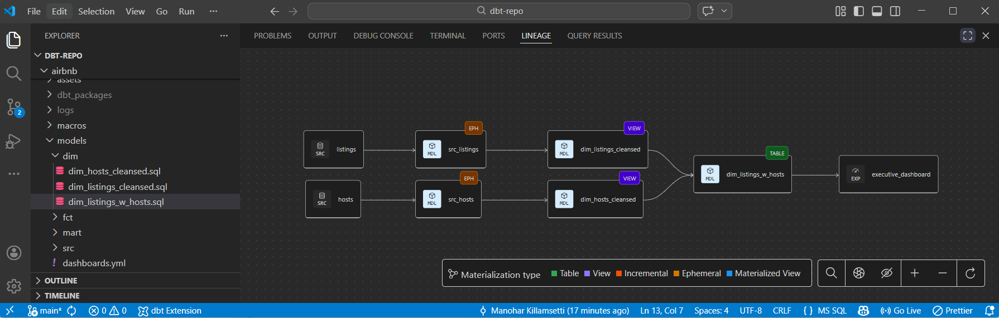

# Airbnb Data Transformation Pipeline (dbt + Snowflake)

## Overview

This project demonstrates a modern **Analytics Engineering pipeline** built using **dbt and Snowflake**.
The pipeline transforms raw Airbnb datasets into clean, analytics-ready models using dbt best practices such as staging models,
dimensional models, incremental loading, data tests, and documentation.

The project simulates a real-world ELT workflow used in modern data platforms.

---

## Architecture

Raw Data (AWS S3)
↓
Snowflake RAW Layer
↓
dbt Staging Models
↓
Data Cleansing & Transformation
↓
Fact & Dimension Tables
↓
Analytics Mart
↓
BI / Dashboard

---

## Tech Stack

- dbt Core
- Snowflake
- SQL
- Python
- Jinja Templates
- dbt-utils package
- Dagster (Orchestration)

---

## dbt Lineage Graph

  

## Project Structure

.
├── models
│ ├── src
│ │ ├── src_listings.sql
│ │ ├── src_hosts.sql
│ │ └── src_reviews.sql
│ │
│ ├── dim
│ │ ├── dim_listings_cleansed.sql
│ │ ├── dim_hosts_cleansed.sql
│ │ └── dim_listings_w_hosts.sql
│ │
│ ├── fct
│ │ └── fct_reviews.sql
│ │
│ └── mart
│ └── mart_fullmoon_reviews.sql
│
├── snapshots
│ ├── raw_hosts_snapshot.yml
│ └── raw_listings_snapshot.yml
│
├── seeds
│ └── seed_full_moon_dates.csv
│
├── macros
│ ├── select_positive_values.sql
│ └── no_empty_strings.sql
│
└── tests

---

## Data Pipeline Layers

### Raw Layer

Data is ingested into Snowflake tables:

- raw_listings
- raw_hosts
- raw_reviews

---

### Staging Models

- src_listings
- src_hosts
- src_reviews

These models standardize column names and prepare raw data for transformation.

---

### Dimension Models

- dim_listings_cleansed
- dim_hosts_cleansed

Key transformations include:

- Data cleansing
- Null handling
- Price normalization
- Minimum night correction

---

### Fact Table

fct_reviews

Features:

- Incremental model
- Surrogate key generation
- Review sentiment tracking

---

### Data Mart

mart_fullmoon_reviews

Analyzes review sentiment during full moon nights by joining review data with moon cycle seed data.

---

## Data Quality & Testing

Implemented dbt tests:

- Unique constraints
- Not null checks
- Relationship tests
- Accepted values tests
- Custom tests
- Unit tests

Example:

SELECT \*
FROM {{ ref('dim_listings_cleansed') }}
WHERE minimum_nights < 1

---

## Snapshots

Snapshots track historical changes for:

- Listings
- Hosts

Implemented using SCD Type 2 strategy.

---

## Documentation

Generate documentation using:

dbt docs generate
dbt docs serve

---

## Running the Project

### Install dependencies

pip install dbt-snowflake
dbt deps

### Run models

dbt run

### Run tests

dbt test

### Run full refresh

dbt run --full-refresh

---

## Orchestration

The dbt pipeline is orchestrated using **Dagster**.

Dagster schedules and manages dbt model runs, enabling:

- Automated pipeline execution
- Monitoring of dbt jobs
- Dependency management between transformations
- Incremental data processing

Dagster UI provides visibility into pipeline runs and allows triggering jobs manually when required.

---

## Future Improvements

- Add CI/CD pipeline for automated dbt testing and deployment
- Implement data observability and monitoring tools
- Deploy production BI dashboards
- Integrate automated alerting for pipeline failures

---

## Author

Manohar Killamsetti
Data Engineer | Analytics Engineer
